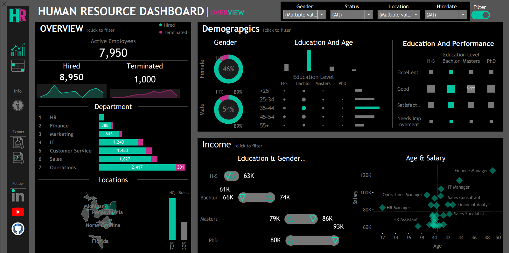
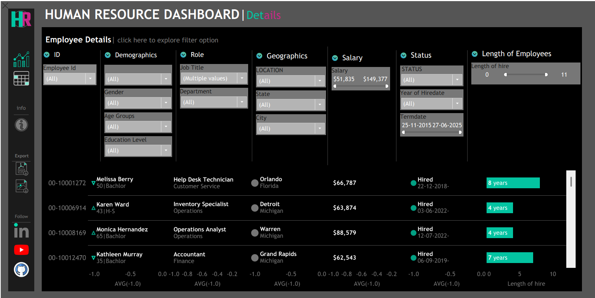

# 👨‍💼 Human Resource Dashboard

## 📌 Project Overview
The **Human Resource Dashboard** is an interactive Tableau dashboard designed to analyze workforce demographics, employee performance, hiring trends, salary distribution, departmental statistics, and employee details. The dashboard enables HR professionals and business leaders to gain actionable insights into workforce composition and organizational performance.

The project consists of two main dashboard pages:

- **Overview Dashboard** – High-level HR KPIs, demographics, department analysis, income distribution, and location insights.
- **Employee Details Dashboard** – Detailed employee-level information with advanced filtering capabilities.

---

## 🎯 Objectives

- Monitor active, hired, and terminated employees.
- Analyze workforce demographics by age, gender, and education.
- Compare employee performance against educational qualifications.
- Evaluate salary trends across departments and roles.
- Track employee tenure and hiring history.
- Provide detailed employee records with interactive filters.

---

## 📊 Dashboard Features

### 1️⃣ HR Overview Dashboard

#### Workforce Summary
- Active Employees
- Total Hired Employees
- Total Terminated Employees
- Hiring Trend Analysis
- Termination Trend Analysis

#### Demographics Analysis
- Gender Distribution
- Education Level Analysis
- Age Group Distribution
- Education vs Performance Comparison

#### Department Analysis
- Employee Count by Department
- Hired vs Terminated Employees
- Department-wise Workforce Distribution

#### Income Analysis
- Salary Distribution by Education Level
- Salary Distribution by Gender
- Education & Gender Income Comparison

#### Geographic Analysis
- Employee Distribution by Location
- State-wise Workforce Mapping

#### Salary Insights
- Age vs Salary Relationship
- Job Role Salary Comparison

---

### 2️⃣ Employee Details Dashboard

#### Employee Information
- Employee ID
- Employee Name
- Age
- Gender
- Education Level

#### Organizational Information
- Job Title
- Department
- Employment Status
- Hire Date
- Termination Date

#### Geographic Information
- Location
- State
- City

#### Compensation Details
- Salary
- Employee Tenure

#### Interactive Filters
- Employee ID
- Gender
- Age Group
- Education Level
- Department
- Job Title
- Location
- State
- City
- Salary Range
- Employment Status
- Hire Date
- Termination Date
- Length of Service

---

## 🛠️ Tools & Technologies

- **Tableau Public**
- **Microsoft Excel**
- **Figma** (Dashboard Background & UI Design)
- **ChatGPT** (Synthetic Dataset Generation Prompt)
- Data Visualization Techniques
- Dashboard Design Principles

---

## 📂 Dataset Information

The dataset used in this project is **synthetically generated** using prompts provided to **ChatGPT** for educational and portfolio purposes.

### Dataset Includes:
- Employee Demographics
- Job Information
- Department Details
- Salary Data
- Hiring & Termination Records
- Geographic Information
- Performance Ratings

> **Note:** This is not real employee data. The dataset was generated for learning, visualization, and portfolio development purposes.

---

## 🎨 Design Credits

### Dashboard Background & UI Design
The dashboard background, layout inspiration, icons placement, and overall visual styling were created using **Figma** and then implemented in Tableau.

### Data Generation
The HR dataset was generated using **ChatGPT prompts** to simulate a realistic Human Resource environment for dashboard development and portfolio showcase purposes.

---

## 📈 Key Insights

- Workforce distribution across departments.
- Gender diversity analysis.
- Education-level impact on employee performance.
- Salary trends by age and role.
- Hiring and termination patterns.
- Geographic workforce concentration.
- Employee tenure analysis.

---

## 📸 Dashboard Preview

### HR Overview Dashboard

### Employee Details Dashboard

---

## 🚀 How to Use

1. Open the Tableau Dashboard.
2. Use the interactive filters at the top.
3. Explore workforce demographics.
4. Analyze department performance.
5. Review salary and employee tenure insights.
6. Drill down into individual employee records.

---

## 👨‍💻 Author

**Kalash Tyagi**

Data Analytics & Business Intelligence Enthusiast

### Skills
- Tableau
- Power BI
- SQL
- Excel
- Python
- Data Visualization
- Dashboard Development

---

## ⭐ Project Purpose

This project was developed to demonstrate:
- HR Analytics
- Tableau Dashboard Design
- Interactive Reporting
- Data Storytelling
- Dashboard UI/UX Design
- Synthetic Data Generation using AI

If you found this project useful, consider giving it a ⭐ on GitHub.
